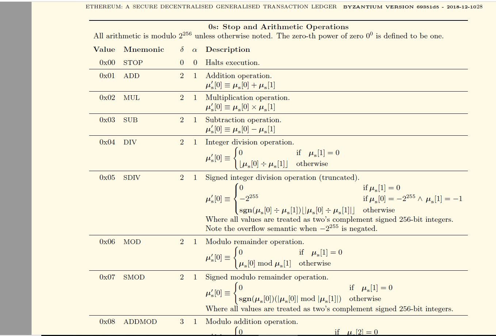
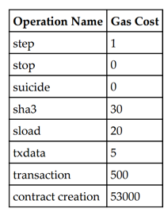

# Understanding Gas on the Ethereum blockchain
A blockchain is a globally shared, transactional database.
The Ethereum virtual machine -(EVM) is an isolated and sandboxed runtime environment.
Every Transaction which is a message sent from one account to another account on the Ethereum network costs gas.

# Why the Ethereum blockchain needs gas?
The Ethereum virtual machine is a computational universal machine, a Turing complete machine that is limited by the amount of gas
required to run any instruction.This means that infinite loops that can potentially result in
denial of service attacks by hackers are not possible due to gas requirements.Soon the loops run out of gas or fuel.
The purpose of charging gas for transactions is to limit the amount of work that is needed
to execute the transaction and to pay for this execution at the same time.

# Gas
It is the internal pricing mechanism for running transactions, processes and smart contracts on the blockchain
A unit of transactional cost on the blockchain. In other words the crypto fuel required to perform transaction on 
Ethereum blockchain

# Gas price: 
The gas price field represents the amount of Wei required to execute a transaction.
Wei is the smallest denomination of ether on Ethereum blockchain
It is a value representing how much Ether the user is willing to pay per gas.
Transaction cost can be estimated using the following formula:

` Total cost = gasUsed * gasPrice `

 # Gas Costs
 Transactional operations on the Ethereum blockchain is done by following the bytecode or opcodes.
 
 Opcodes or bytecodes are instructions for the EVM.Each opcode costs a certain amount of gas.
 
 A good list of available opcodes can be found on the [Ethereum Yellow paper](https://ethereum.github.io/yellowpaper/paper.pdf)
 
 See chart below:

 
The different gas requirements can be found on [page 26 in the Ethereum Yellow paper](https://ethereum.github.io/yellowpaper/paper.pdf)

 see Chart below
 

# Advice for Ethereum Blockchain developers in Solidity 
As blockchain developer, it is advisable to be aware of the gas costs of transactions when writing smart contracts.
As much as possible contract developers must try and avoid loops unless they know how much gas it consumes at all times.

# Gas Charges
Gas is charged under these scenarios and circumstances on the blockchain
* Storage or an Increase in the usage of memory
* When computations are performed on operations
* When there is a message call or contract creation  

## Gas Cost Table 
Table below shows a typical transaction cost chart

As an example, from the table,  an sload transaction costs 20 gas
Assume that current gas price is 20 GWei, convert it into ether, which is
0.000000020 Ether. After multiplying both: 0.000000020 * 20, we get 0.00000040
Ether.
In total, 0.00000040 Ether is the total gas that will be charged.

## Code Examples
`sload = 20 gas

 gasPrice = 20Gwei or 0.000000020 Ether
 
 Total cost = gasUsed * gasPrice
 
 0.000000020 * 20 = 0.00000040 Ether`
 
## Helpful links
Open source project which aims to increase the transparency of gas prices is [ETH Gas Station](https://ethgasstation.info/index.php)

## Contact
Created by [Raynold](https://ca.linkedin.com/in/raynold-gyasi-036631119) - Email:speedyray2ray@gmail.com Feel free to contact me!

