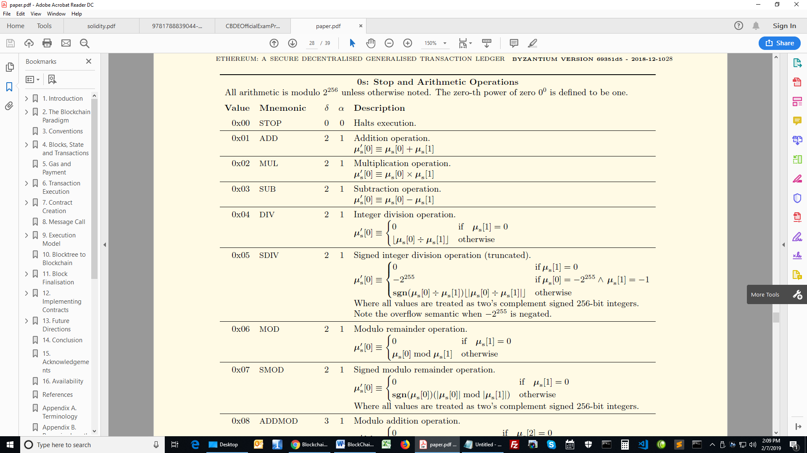
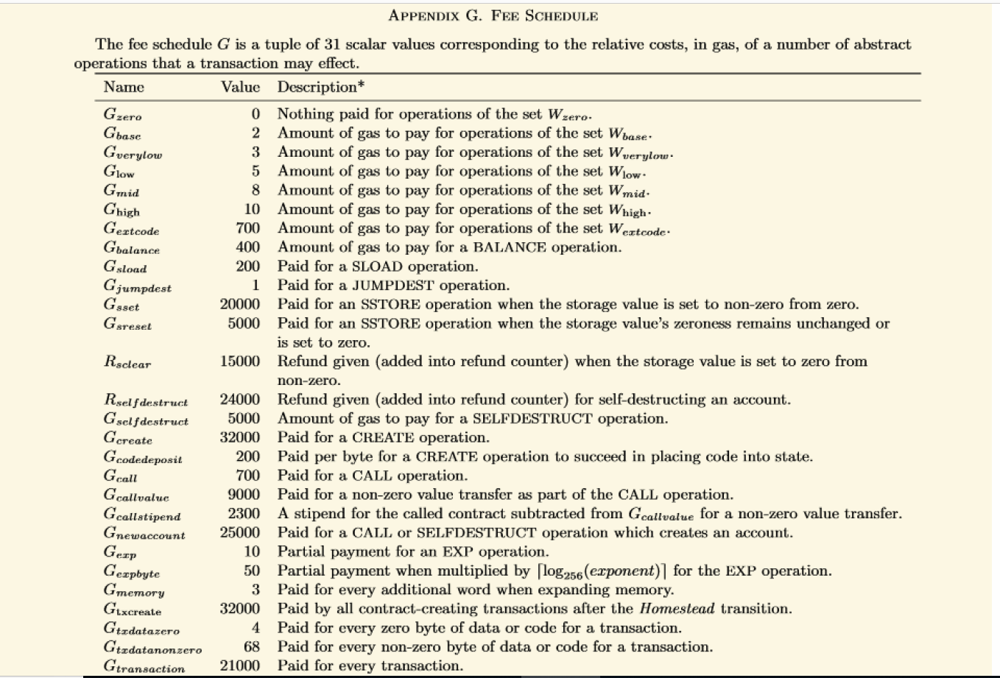

# Understanding Gas on the Ethereum blockchain
A blockchain is a globally shared, transactional database.
The Ethereum virtual machine -(EVM) is an isolated and sandboxed runtime environment.
Every Transaction which is a message sent from one account to another account on the Ethereum network costs gas.

# Why the Ethereum blockchain needs gas?
The Ethereum virtual machine which is a computationally universal machine but is limited by the amount of gas
that is required to run any instruction. This means that infinite loops that can potentially result in
denial of service attacks by hackers are not possible due to gas requirements.Soon the loops run out of gas or fuel.
The purpose of charging gas for transactions is to limit the amount of work that is needed
to execute the transaction and to pay for this execution at the same time.

# Gas
A unit of transactional cost on the blockchain. In other words the crypto fuel required to perform transaction on 
Ethereum blockchain

# Gas price: 
The gas price field represents the amount of Wei required to execute a transaction.
Wei is the smallest denomination of ether on Ethereum blockchain
It is a value representing how much Ether the user is willing to pay per gas.
 
 `Total Gas Cost or Total transaction cost =  gas_price * gas_used`

 # Gas Costs
 Transactional operations on the Ethereum blockchain is done by following the bytecode or opcodes.
 
 Opcodes or bytecodes are instructions for the EVM.Each opcode costs a certain amount of gas.
 
 A good list of available opcodes can be found on the [Ethereum Yellow paper](https://ethereum.github.io/yellowpaper/paper.pdf)
 
 
The different gas requirements can be found on [page 26 in the Ethereum Yellow paper](https://ethereum.github.io/yellowpaper/paper.pdf)

My motivation is to practise coding anytime anywhere

## Technologies
* pragma solidity  - version >=0.4.0 <0.6.0;

## Setup
Tested written code directly on remix.ethereum.org

## Code Examples
Declare a state variable of type address that is publicly accessible

Map an address to unint values

 `mapping (address => uint) public balances;`
     
  Constructor will fire when this contract is created
  Set inventor as creater of this contract:
  
  ` constructor() public {
     inventor = msg.sender;
   }`

## Status
Project is: _finished_

## Inspiration
Credits to Solidity documentation

## Contact
Created by [Raynold](https://ca.linkedin.com/in/raynold-gyasi-036631119) - feel free to contact me!

